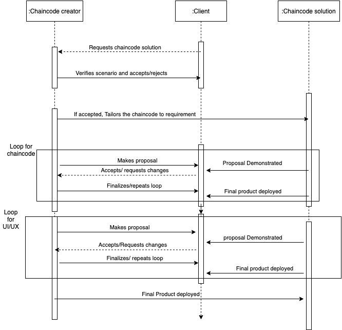
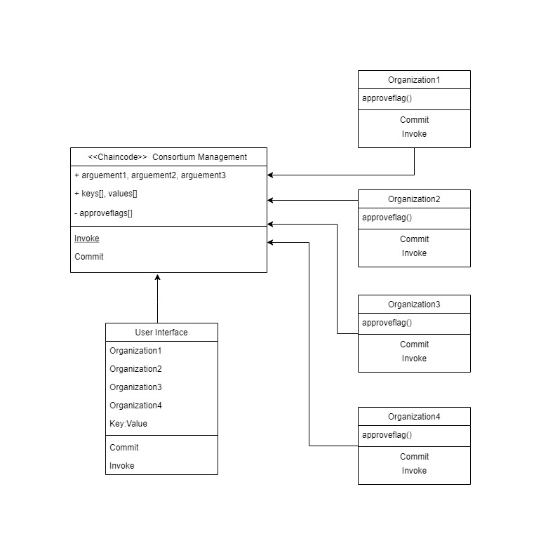

# Consortium Boilerplate Dapp

# Description:
This project was developed to be a boilerplate for any private blockchain project using Hyperledger Fabric. The Minimum Viable Product(MVP) has been completed but its not industry grade. Furthermore, this project was made to be an tutorial for anyone new trying to learn Hyperledger Fabric.

To learn more about this project please refer to the documentation.pdf file in the project folder.

# Sequence Diagram

# Class Diagram

# How to Run
This project was built using Google Cloud Platform VM Instance and its highly recommended to run so.

Make sure to clone the Hyperfabric Fabric Samples as it is required to setup a test network with /bin and /config folders

Copy the following commands to setup the network , inside the /fabric-samples folder
	
	git clone https://github.com/nerajok/demo.git
	curl -sSL http://bit.ly/2ysbOFE | bash -s
	cp -R ./PlateRegistry-DApp/platechain/ ./
	cp -R ./PlateRegistry-DApp/chaincode/ ./
	cp -R ./PlateRegistry-DApp/test-network/ ./
	cd chaincode/platechain/javascript/
	npm install
	cd ../../../
	cd platechain/
	./networkDown.sh 
	./startFabric.sh  javascript
	
This will setup the hyperledger fabric network where 'platechain' chaincode are installed on org1 and org2

We need two seperate VM Instances for backend and frontend

For backend server setup , copy the following the commands [current directory : /fabric-samples/platechain/]

	cd express-backend/
	npm install
	node enrollAdmin.js 
	node registerUser.js
	node backend.js 
	
The backend server will start run on port 4001

Before setting the frontend server , make sure to do the following changes [current directory : /fabric-samples/platechain/]

		Go to App.js which is inside [/react-frontend/src] and change the YOUR_EXTERNAL_IP value with your VM Instance External IP Address
		
			constructor() {
				super()
				this.state = {
					showFeed: false,
					connected: false,
					socket : socketIOClient("http://[YOUR_EXTERNAL_IP]:4001/"),
					blocks : [],
				}
				this.switchFeedHandler = this.switchFeedHandler.bind(this);
			}

This will connect to the backend server and make sure the connection is only 'http'
	
After changing the value, copy the following the commands to setup frontend server [current directory : /fabric-samples/platechain/]

	cd react-frontend/
	npm install
	npm start
	
The backend server will start run on port 3000

Both servers can be used with YOUR_EXTERNAL_IP value ,so it will be

		Backend server : http://[YOUR_EXTERNAL_IP]:4001/
		Frontend server : http://[YOUR_EXTERNAL_IP]:3000/

Note : If you are not able to access the server outside the instance , check the firewall rules for VM Instance to allow these ports 4001 and 3000.

# Resources
BLOCKCHAIN NETWORK
1. Hyperledger fabric samples(test-network is used).
2. Fabric node SDK
3. Docker

BACKEND
1. Fabric network
2. Express
3. Socket.io

FRONTEND
1. React
2. Socket.io client